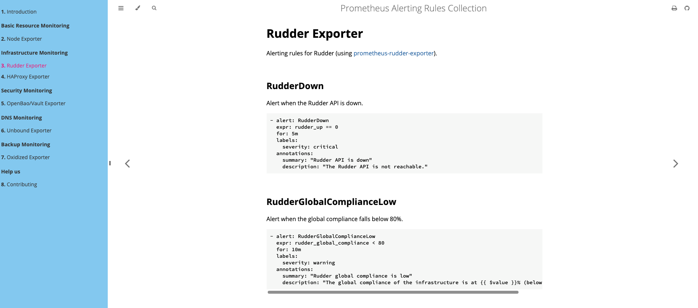

# Prometheus Alerting Rules Collection

This repository hosts a comprehensive collection of Prometheus alerting rules, maintained with 🩷 by the **Cloud du Coeur** team.

## Documentation

Access the full documentation and browse the rules here:
[https://cloudducoeur.github.io/collection-prometheus-alerting-rules/](https://cloudducoeur.github.io/collection-prometheus-alerting-rules/)

## Contributing

Contributions are open to everyone! Whether you want to add a new rule, fix a typo, or improve existing alerts, we welcome your help.

For more details on how to contribute, please refer to our contribution guide:
[https://cloudducoeur.github.io/collection-prometheus-alerting-rules/CONTRIBUTING.html](https://cloudducoeur.github.io/collection-prometheus-alerting-rules/CONTRIBUTING.html)

